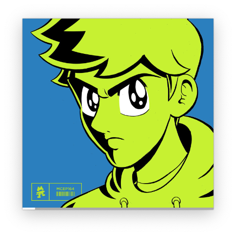
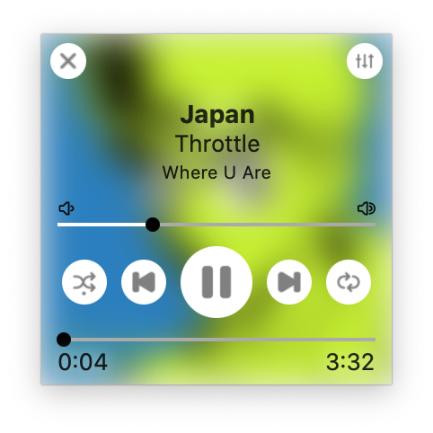
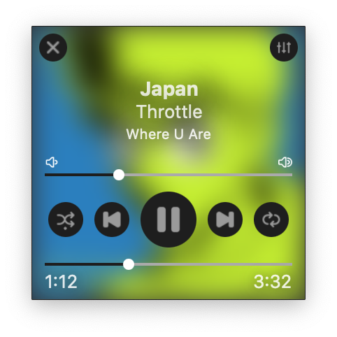

# Tracklist
TrackList is a macOS app that acts as a miniplayer for audio players, similar to picture-in-picture. Currently, Spotify is the only streaming service that TrackList works with, although more platforms are planned.

## Screenshots

### Unfocused

### Light Mode (Focused)

### Dark Mode (Focused)

## Credits & Thanks

I used Kingfisher to load the album artwork in the overlay. It's very simple to use and effective! Check out the project [here][kingfisher-repo].

The icons I used in this app are from [JAM][JAM-website] that I modified by filling them in. Thanks to JAM for providing high quality icons for free!

[kingfisher-repo]: https://github.com/onevcat/Kingfisher
[JAM-website]: https://jam-icons.com
